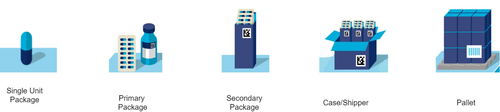

# Pharma Supply Chain Counterfeit Detection and Prevention using Distributed Ledger 
      
    

## Introduction

 

  
  

## Abstract 

## Proposed Architecture 

## Usecases 
  - <b>Addition of Medicine into Supply Chain</b>
    
  - <b>Fake Medicine Detection</b>
   
## Demo
[Click here]() to access the webpage.

## Acknowledgement
We would like to acknowldge the support provided by **TIFAC-CORE in Cyber Security**, Amrita School of Engineering, Amrita Vishwa Vidyapeetham, Coimbatore, India in carrying out this work as part of "**20CY712 - Blockchain Technology**" Course. 

## References

 - Ramaguru R, Minu M. Blockchain Terminologies. NamChain Open Initiative Research Lab (2021). https://github.com/NamChain-Open-Initiative-Research-Lab/Blockchain-Terminologies

